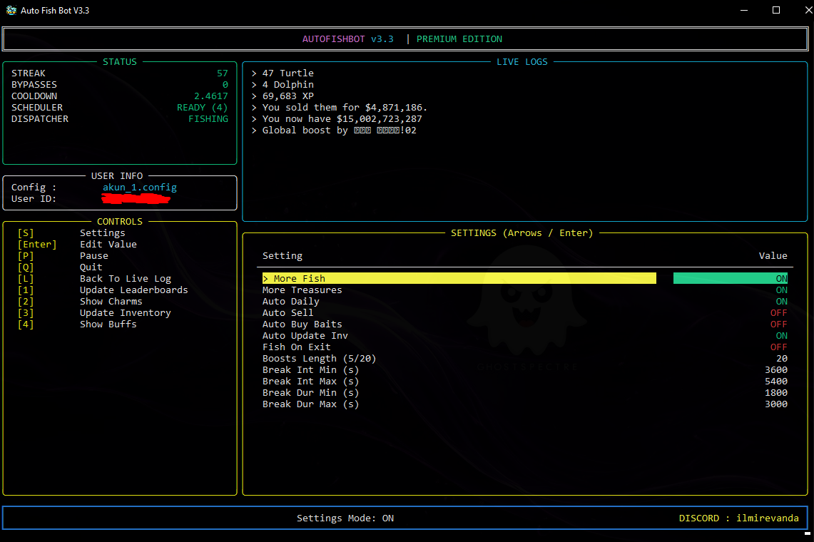

**AUTO FISH VIRTUAL FISHER BOT DISCORD (V3.3)**

## New Display Menu 3.3 (Modern UI)



## Features
- **Auto Fish**: Full support for Slash Commands & Buttons interactions.
- **Modern TUI**: Beautiful, interactive, and colorful interface with real-time logs.
- **Live Settings**: Modify gameplay settings (Refresh Rate, Boosts, etc.) on-the-fly without restarting.
- **Smart Break System**: Configurable random intervals and durations for breaks to mimic human behavior (Anti-Ban).
- **Captcha Bypass**: Automatic captcha solving using 2Captcha API.
- **Full Automation**: 
  - Auto Boosts (Choice of 5 or 20 minutes)
  - Auto Daily Rewards
  - Auto Sell Fish
  - Auto Buy Baits
  - Auto Update Inventory
- **Manual Input**: Type specific values for settings directly in the menu for precision.
- **Dynamic Refresh Rate**: Adjustable UI refresh rate for optimal performance.
- **Secure Configuration**: Sensitive credentials (Token/API Key) are separated from gameplay settings.
- **Cross-Platform Support**: Windows, MacOS, Linux.

## Get Guild and Channel ID


## Captcha Bypass


## Configuration
The `.config` file is used for credentials and system settings. Gameplay settings (Automation) are now managed inside the bot's menu and saved to `settings.json`.

```ini
# Example .config file

[SYSTEM]
USER_TOKEN = Your_Token_Here
USER_COOLDOWN = 3.5
CHANNEL_ID = 123456789
GUILD_ID = 987654321
DEBUG = False

[CAPTCHA]
OCR_API_KEY = Your_2Captcha_Key

[NETWORK]
# Optional Proxy Settings
USER_AGENT = 
PROXY_IP = 
PROXY_PORT = 
PROXY_AUTH_USER = 
PROXY_AUTH_PASSWORD = 

[COSMETIC]
# Optional In-Game Cosmetics
PET = dolphin
BAIT = fish
BIOME = ocean
```

## Need help?
Contact [DISCORD](https://discord.com/users/632495220034109450).

## Payment
Contact [DISCORD](https://discord.com/users/632495220034109450).

## What do you get after payment?
- Application password
- 2captcha API key with a balance of $3
- Full support if you encounter any problems

## Payment Methods
- PayPal only

## System Requirements
- Support for Windows 10/11.


