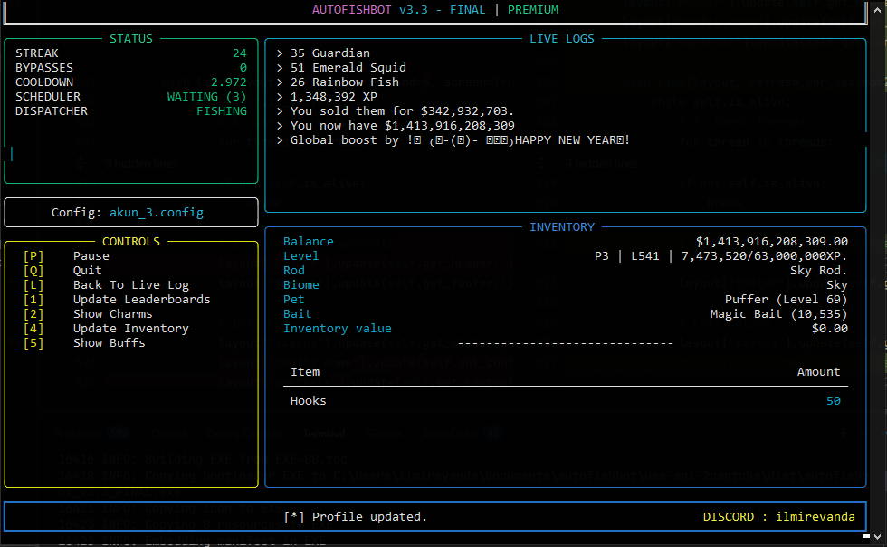
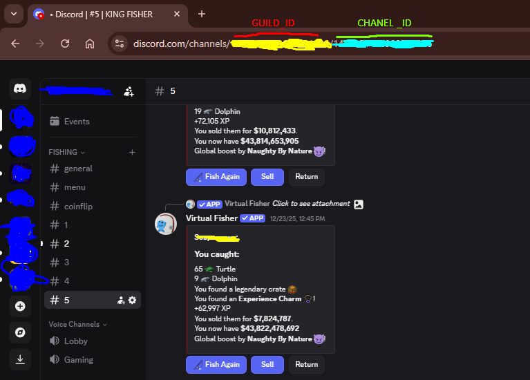
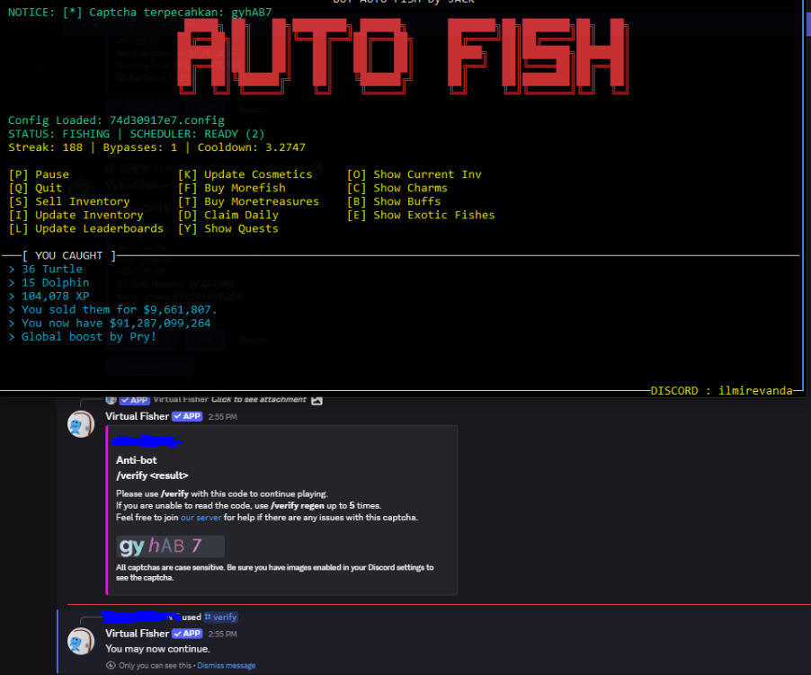

**AUTO FISH VIRTUAL FISHER BOT DISCORD**
## New Display Menu 3.3

## Features
- Auto Fish 
- Menu (TUI)
- Captcha Bypass
- Full-featured (auto boosts, auto daily, auto sell, and +)
- Interactions (buttons and slash commands)
- **SECURE & PROTECTED CODE (Anti-Tamper)**
- **Cross-Platform Support (Windows, MacOS, Linux)**

## Get Guild and Chanel ID

## captcha bypas


```
config
#Example
[SYSTEM]
user_token = M@yToke_n123
user_cooldown = 3.5
channel_id = 123456
debug = False

[CAPTCHA]
ocr_api_key = 2captcha_api_key

[NETWORK]
user_agent = 
proxy_ip =
proxy_port =
proxy_auth_user = 
proxy_auth_password = 

[AUTOMATION]
boosts_length = 5
more_fish = True
more_treasures = False
fish_on_exit = True
auto_daily = True
auto_buy_baits = False
auto_sell = True
auto_update_inventory = False

[COSMETIC]
pet = dolphin
bait = fish
biome = ocean
```
## Need help contact [DISCORD](https://discord.com/users/632495220034109450).
## Payment contact [DISCORD](https://discord.com/users/632495220034109450).
## What do you get after payment ?
- Application password
- 2captcha API key with a balance of $3
- Full support if you encounter any problems
## Payment only through PayPal
## Support for Windows 10/11, MacOS, and Linux (Secure Build)
